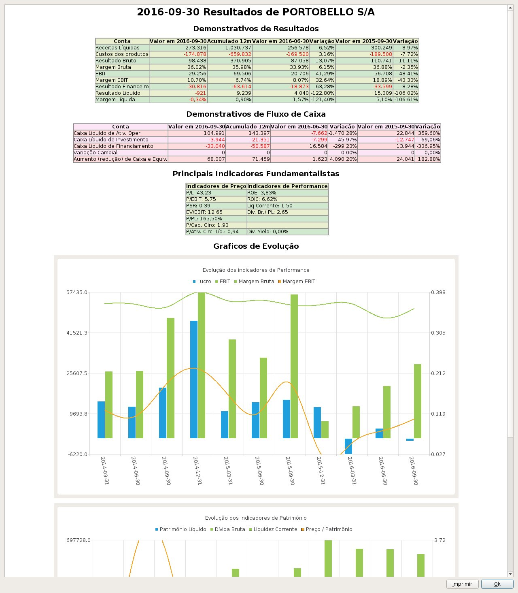

# Exercise 1: Web Scrapping (PAC 1) 
by Javier Alperte Pérez-Rejón

## Dataset title

Quarterly results of Brazilian public companies (Bovespa)

## Dataset subtitle 

This dataset contains the quarterly economic results delivered by companies listed on the Brazilian stock exchange. 

These results are presented in the form of a Balance Sheet, Profit and Loss, and Cash Flow.

## Imatge



## Context

There are different approaches to investment analysis. One of these approaches is the [Value Investing](https://www.investopedia.com/terms/v/valueinvesting.asp) method.

This method tries to discover important gaps between the market price of the shares of the companies (official price on the stock exchange), and the real price of the company, known as the [Intrinsic Value] (https: / /www.investopedia.com/terms/i/intrinsicvalue.asp).
 
The ultimate goal is to invest in those companies with a very low or much higher intrinsic value than the public one (stock exchange).

In order to be able to calculate the intrinsic value of Brazilian companies, we need to have access to the quarterly economic reports that companies deliver every three months. 

And that is the reason for this utility, to extract the economic reports presented by the Brazilian companies on the stock market of São Paulo. 

## Content

The dataset is composed by more than 400 field:

- the first three fields identify the company code in Bovespa (CCVM), the fiscal period (period), and the version of the deliver documents.
- the rest of the fields are a reference to each account of the Brazilian official accounting plan 

You can see an example inside the `data` folder. We can see an example of the dataset in the file [dataset.csv](./data/dataset.csv), and its data dictionary in the file [dictionary.csv](./data/dictionary.csv).

## Acknowledgments

The data comes from the CVM (Comissao de Valores Mobiliarios), the Securities and Exchange Commission of Brazil. Its objective is oversee, regulate, discipline and develop the securities market in Brazil. 

Resources:

- Subirats, L., Calvo, M. (2018). Web Scraping. Editorial UOC.

- Lawson, R. (2015). Web Scraping with Python. Packt Publishing Ltd. Chapter 2. Scraping the Data.

- Post [Automatização de balanços](http://clubinvest.boards.net/thread/367/automatiza-de-balan-os) explaining the documents available from Bovespa, and how to access to them. 

- http://www.potuz.net/denet/. An implementation in C++ of a system to do fundamental analysis using the information from Bovespa. 

## Inspiration

I have read some books on Value Investing and I found them very interesting.

After those readings, I decided to focus my project of the end of this master in develop a set of models to help me identify investing patterns.


## License

This software has been licensed under CC BY-SA 4.0.

With this license you are free to:

- __Share__ — copy and redistribute the material in any medium or format
- __Adapt__ — remix, transform, and build upon the material
for any purpose, even commercially.

With the following conditions:

- __Attribution__: you must give appropriate credit, provide a link to the license, and indicate if changes were made. You may do so in any reasonable manner, but not in any way that suggests the licensor endorses you or your use.

- __ShareAlike__: if you remix, transform, or build upon the material, you must distribute your contributions under the same license as the original.
 
 
 ## Code

__crawl.py__: is the main function of the crawler. The crawler is divided intro three phases:

1. __crawling_parts/listed_companies.py__: crawl all the listed companies in Bovespa (ancient and new)

2. __crawling_parts/company_files.py__: crawl the list of delivered files by the companies to Bovespa.

3. __crawling_parts/download_file.py__: download the delivered files, extract the financial information from them, and generate the `data/dataset.csv` and `data/dictionary.csv` files

The __throttle.py__ contains an implementation of a decorator to be used in the functions we want to throttle. The functions that we are actually throttling are:

- `update_listed_companies` (crawling_parts/listed_companies.py): 50 requests by minute.

- `obtain_company_files` (crawling_parts/company_files.py): 50 requests by minute.

- `download_file` (crawling_parts/download_file.py): 50 requests by minute.

The __utils.py__ contains some utility methods to manage the control files and date time objects. 

The __ctl__ folder will be used by the crawler to generate checkpoint files for each of the previous stages. This control files will help us to continue the process  to continue the process from where it was left in case the process exited unexpectedly.
 
The __crawler_cache__ folder will be used by the script as the default cache folder to leave all the downloaded files, and to unzip the files for futher processing.

The __data__ folder will contains the csv files generated by the crawler. We can now see an example of:
 
- `companies.csv`: the listed companies in Bovespa. Generated by the first stage of the crawling process.
- `dataset.csv`: the dataset with all the financial information for all the listed companies. Generated by the last stage of the crawling process.
- `dictionary.csv`: the data dictionary associated with the `dataset.csv` file. Generated by the last stage of the crawling process.

Some details about the implementation:

- We use multiprocessing Pool to crawl faster. 
- We use of a custom Throttler to make sure we call the source using a request/second policy (20 request per minute).
- We use checkpoint files to take control of the already crawled parts and start the proces from the previos checkpoint if something wrong happen during the process.


### Installation

To run the crawler we will need to install the [PhantomJS](http://phantomjs.org/) library.

- In MacOS we can use brew to install it: `brew install phantomjs`

- In [this page](http://phantomjs.org/download.html) we can also found the installers for all the platforms.

We will need to remember the installation folder because a reference to the `..../bin/phantomjs` folder will be needed. 

The crawler is implemented for Python 3.7. Then we will need a 3.7 environment ready to install the dependencies.

We can use [Anaconda](https://conda.io/docs/installation.html) to manage the environment. Once Anaconda is present in our system, we can do the following steps:

```
$ conda create -n bovespa_crawler python=3.7
$ conda activate bovespa_crawler
$ pip install -r requirements.txt
``` 

Now the crawler should be ready to run.

### Run the crawler

To run the crawler we only need to run the `crawl.py` script. The crawler can be invoked using the following config parameters:

Arguments:

- `--phantomjs-path`: The path where we can found the PanthomJS library installed. Default: `None`. Ex: "/phantomjs-2.1.1-macosx/bin/phantomjs".

- `--from-date`: Extract only the data after an specific date. Default: `None`. Ex: "2018-01-01".

- `--cache-folder`: The folder we want to use to save the downloaded files. Default: `./crawler_cache`. Ex: /data/crawlers/bovespa.

- `--workers-num`: The number of parallel threads crawling. Default: `10`. Ex: 20.

- `--force-crawl-listed-companies`: If we want to bypass the checkpoint control and crawl the basic data of all the open companies in bovespa. Ex: --force-crawl-listed-companies.

- `--force-crawl-company-files`: If we want to bypass the checkpoint control and crawl the company files since the begining. Ex: --force-crawl-company-files.

- `--include-companies`: If we want to focus only on a specific companies. Ex: 35 94 1384.


Examples:

- Crawl all the companies using 5 parallel processes

```
python crawl.py \
    --phantomjs-path "/phantomjs-2.1.1-macosx/bin/phantomjs" \
    --workers-num 5
```
    
- Crawl all the companies using 5 parallel processes and only files published after 2018-06-01

```
python crawl.py \
    --phantomjs-path "/phantomjs-2.1.1-macosx/bin/phantomjs" \
    --workers-num 5 \
    --from-date "2018-06-01"
```    
    
- Crawl companies with the following CCVM codes only: 

    - 86 - ACOS DO BRASIL SA IND E COM
    - 13773 - PORTOBELLO S/A
    - 9512 - PETRÓLEO BRASILEIRO  S.A.  - PETROBRAS
    
```
python crawl.py \
    --phantomjs-path "/phantomjs-2.1.1-macosx/bin/phantomjs" \
    --workers-num 5 \
    --include-companies 86 13773 9512
```    
    
    
## Dataset

The dataset has been generated using 5134 companies and 14018 financial reports.

Dataset: [dataset.csv](./data/dataset.csv)

Data Dictionary: [dictionary.csv](./data/dictionary.csv)
  